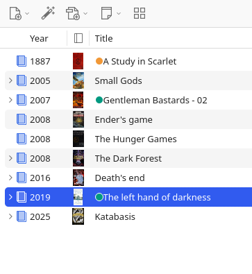

# Cover View for Zotero

Cover View is a [Zotero](https://www.zotero.org) extension that displays the covers of items more prominently.
Switch between the default list view and grid view using a toggle button in the toolbar or preview thumbnails directly in list view with the 'Cover' column.

  
  &emsp;&emsp;&emsp;&emsp;
  

## Features

- **Grid view**
  - display items in a grid instead of a list
  - switch between grid view and list view with a button in the toolbar
- **List view**: provides 'Cover' column with thumbnail of cover
- **Cover extraction options**
  - from image attachments (including `.jpg` and `.png`)
  - first page of `.epub` or `.pdf` attachment
  - optional: fetch missing covers from web using ISBN
  - optional: fetch missing covers from web using metadata (may yield the wrong cover)
- **Settings**
  - customize the appearance of the grid tiles
  - change the grid size

## Installation

- Download the latest release (`.xpi` file) from:
  - [Latest Stable](https://github.com/paulluis-roehl/zotero-cover-view/releases/latest)
  - [All Releases](https://github.com/paulluis-roehl/zotero-cover-view/releases)

  _Note_: If you're using Firefox as your browser, right click the `.xpi` and select `Save Link As...`.

- In Zotero click `Tools` in the top menu bar and then click `Plugins`
- Click the gear icon in the top right of the Plugins Manager.
- Select `Install Plugin From File`.
- Browse to where you downloaded the `.xpi` file and select it.
- Done!

## Acknowledgements

- Based on the [Zotero Plugin Template](https://github.com/windingwind/zotero-plugin-template) by [@windingwind](https://github.com/windingwind).
- Inspired by [this](https://forums.zotero.org/discussion/121736/feature-request-cover-flow-or-book-jacket-image-display-view) discussion on the Zotero forum.
- ISBN and metadata-based cover images for books are provided by [Open Library](https://openlibrary.org/) through its [Covers API](https://openlibrary.org/dev/docs/api/covers).

## Disclaimer

This project is licensed under the AGPL-3.0 and is provided as-is, without any warranties or guarantees.
